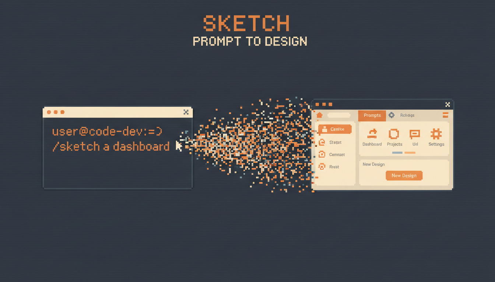

# sketch



A Claude Code plugin that generates visual content using Google Gemini. Ads, app store assets, social media posts, UI mockups, pitch deck slides, product shots, email headers, infographics, brand assets, packaging mockups, sales collateral — describe what you need, Claude generates it with expert-level creative guidance, and you iterate until it's right.

Claude identifies the content type, auto-selects the right dimensions and style rules, analyzes your codebase for brand context, and applies industry best practices — so you get professional results without being a designer.

## What it does

1. You describe what you want ("sketch me an Instagram ad for our new product launch")
2. Claude detects the content type and applies expert creative guidance (dimensions, style, best practices)
3. Scans your project for design context (colors, UI framework, brand assets)
4. Generates 1 expert-crafted image using Google Gemini
5. Opens it, describes it, and asks what you think
6. You tweak, regenerate, or start over — loops until you're done

## Install

### 1. Set your Google AI API key

Get one from [Google AI Studio](https://aistudio.google.com/apikey), then add to your shell profile (`~/.bashrc`, `~/.zshrc`):

```bash
export GOOGLE_AI_API_KEY="your-key"
```

### 2. Install the plugin

**From GitHub (two steps):**

```
/plugin marketplace add andrsnn/claude-sketch
/plugin install sketch@andrsnn-claude-sketch
```

This permanently adds the plugin - no flags needed on future sessions.

**Or from a local directory (for development):**

```bash
claude --plugin-dir /path/to/claude-sketch
```

Script dependencies (`@google/genai`) install automatically on first use.

## Usage

### Natural language (auto-triggers)

Just ask in conversation — the skill detects the content type and applies the right guidance:

**Ads & Marketing:**
- "Create an ad for our new coffee blend"
- "Design a promotional banner for our summer sale"
- "Make a retargeting ad for abandoned cart users"

**Social Media:**
- "Make an Instagram post announcing our product launch"
- "Design a YouTube thumbnail for my tutorial video"
- "Create a Pinterest pin for this recipe"
- "Design a LinkedIn post graphic about our Series A"

**App Store:**
- "Generate app store screenshots for my fitness app"
- "Design an app icon for a weather app"
- "Create a Google Play feature graphic"

**UI/UX:**
- "Sketch me a landing page with a hero section and pricing table"
- "Mock up a mobile version of this dashboard"
- "Generate a wireframe for the settings page"

**Presentations:**
- "Design a pitch deck slide showing our growth metrics"
- "Create a presentation cover slide for our Q4 review"

**Product & E-commerce:**
- "Create a product hero shot for our new headphones"
- "Design a category banner for the shoe collection"

**Email:**
- "Design an email header for our newsletter"
- "Create a hero image for our product launch email"

**Content Marketing:**
- "Create a blog header image for an article about AI trends"
- "Design an infographic about our company's impact"

**Brand & Sales:**
- "Design a logo concept for a sustainable fashion brand"
- "Create a one-pager for our enterprise sales team"
- "Design a case study graphic highlighting customer results"

### With reference images

Point to an existing image to maintain visual consistency:

- "Create a social post using `./sketches/brand-style.png` as style reference"
- After generating: "Tweak this — make the background darker"

## How iteration works

After generating an image, you can:

- **Tweak** — Keep the image as reference, describe changes, get an updated version
- **Regenerate** — Fresh generation with adjusted prompt based on your feedback
- **Start over** — Describe something completely different
- **Done** — You're satisfied, move on

## Standalone script

The generation script works independently of Claude Code:

```bash
node scripts/generate-image.mjs \
  --prompt "a flat vector illustration of a rocket launching" \
  --output ./rocket.png \
  --aspect-ratio "1:1" \
  --reference ./existing-style.png
```

Outputs JSON: `{ "success": true, "output": "./rocket.png", "description": "..." }`

## Project structure

```
claude-sketch/
├── .claude-plugin/plugin.json         # Plugin metadata
├── skills/sketch/
│   ├── SKILL.md                       # Auto-trigger skill (core workflow)
│   └── references/prompt-guide.md     # Prompt engineering reference
├── scripts/
│   ├── generate-image.mjs             # Gemini image generation CLI
│   ├── package.json                   # Self-contained dependencies
│   └── setup.sh                       # Dependency installer
└── README.md
```

## Requirements

- Node.js 18+
- `GOOGLE_AI_API_KEY` environment variable
- Claude Code with plugin support
